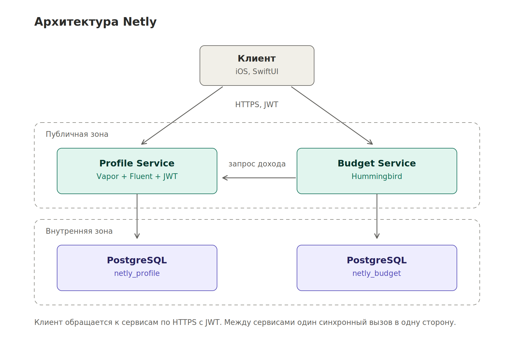

# Netly

## Предметная сфера

Персональные финансы: учёт доходов, обязательных расходов, подписок, задолженностей и накопительных целей. Приложение приводит доходы разной периодичности к месячному эквиваленту, вычисляет свободный остаток и распределяет его между целями по приоритетам.

Клиент — приложение для iOS на SwiftUI. Серверная часть — три независимых микросервиса на Swift.

Бизнес-задача, пользовательские истории с критериями приёмки и декомпозиция на микросервисы: [`docs/requirements.md`](docs/requirements.md).

## Архитектура

<picture>
  <source media="(prefers-color-scheme: dark)" srcset="docs/architecture-dark.png">
  
</picture>

Публичной является только зона API Gateway. Микросервисы, базы данных и брокер размещаются во внутренней сети и недоступны извне. Сервисы взаимодействуют между собой асинхронно через шину событий, прямые синхронные вызовы не предусмотрены.

| Сервис | Зона ответственности | Порт |
|---|---|---|
| `profile-service` | Аутентификация, онбординг, источники дохода, обязательные расходы | 8081 |
| `cashflow-service` | Подписки, задолженности, расчёт денежного потока | 8082 |
| `savings-service` | Накопительные цели, распределение остатка, уведомления | 8083 |

## Технологический стек

| Компонент | Технология | Язык | Хранилище |
|---|---|---|---|
| Клиент | SwiftUI, iOS 17+ | Swift | SwiftData |
| API Gateway | Vapor | Swift | — |
| Profile Service | Vapor, Fluent | Swift | PostgreSQL |
| Cashflow Service | Vapor, Fluent, Queues | Swift | PostgreSQL, Redis |
| Savings Service | Hummingbird | Swift | PostgreSQL |
| Шина сообщений | RabbitMQ | — | — |
| Среда исполнения | Docker, Docker Compose | — | — |

## Как запустить

Текущее состояние: реализованы скелеты трёх сервисов с эндпоинтом `/health`.

Требуется Swift 6.0 или новее.

### Отдельный сервис

```bash
cd services/profile-service
swift run
```

### Все сервисы через Docker

```bash
docker compose up --build
```

### Проверка

```bash
curl http://localhost:8081/health
curl http://localhost:8082/health
curl http://localhost:8083/health
```

Ответ:

```json
{ "status": "ok", "service": "netly-profile" }
```

## Структура репозитория

```
netly/
├── docs/
│   ├── requirements.md          бизнес-задача, истории, декомпозиция
│   ├── architecture.drawio      исходник схемы
│   ├── architecture.png
│   └── architecture-dark.png
└── services/
    ├── profile-service/
    ├── cashflow-service/
    └── savings-service/
```
