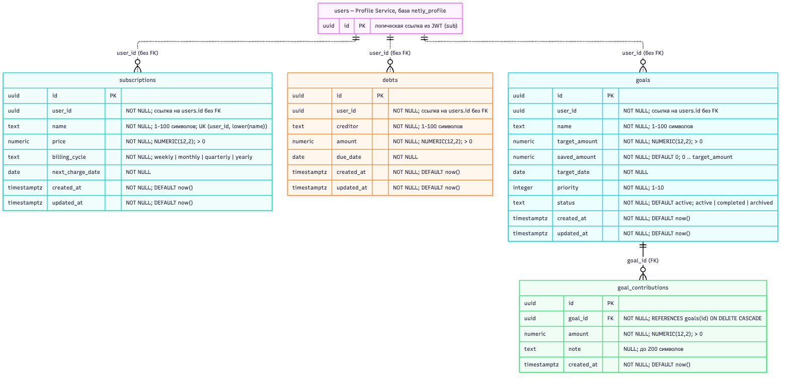
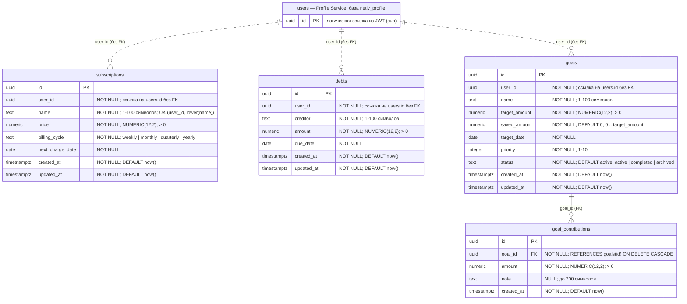

# Схема данных Budget Service

СУБД: PostgreSQL 16, база `netly_budget`. Схема описана миграциями в [`services/budget-service/Sources/App/Database/Migrations`](../services/budget-service/Sources/App/Database/Migrations) и создаётся командой `App migrate`, вручную через SQL-консоль ничего не меняется.

## ER-диаграмма



Исходник диаграммы, который GitHub отображает и как текст:



Связь `goals` → `goal_contributions` — один ко многим: у цели может быть сколько угодно пополнений, каждое пополнение принадлежит ровно одной цели. Это единственный внешний ключ схемы.

`user_id` в `subscriptions`, `debts` и `goals` ссылается на пользователя. Таблица `users` принадлежит Profile Service и хранится в его базе `netly_profile`, а у каждого микросервиса своя база, поэтому на диаграмме `users` — внешняя сущность, а связи с ней нарисованы пунктиром. Внешнего ключа на пользователя нет и быть не может: PostgreSQL не ссылается на таблицы другой базы. `user_id` берётся из поля `sub` подписанного JWT, так что ссылочную целостность между сервисами обеспечивает подпись токена, а не СУБД.

## Связи между таблицами

| Ссылка                        | На что ссылается             | Тип         | Как обеспечивается                                              |
| ----------------------------- | ---------------------------- | ----------- | --------------------------------------------------------------- |
| `goal_contributions.goal_id`  | `goals.id`                   | 1:N, FK     | Внешний ключ `goal_contributions_goal_id_fkey`, ON DELETE CASCADE |
| `subscriptions.user_id`       | `users.id` (Profile Service) | 1:N, без FK | Значение из подписанного JWT; фильтр `user_id` во всех запросах |
| `debts.user_id`               | `users.id` (Profile Service) | 1:N, без FK | То же                                                           |
| `goals.user_id`               | `users.id` (Profile Service) | 1:N, без FK | То же                                                           |

## Таблицы

### `subscriptions` — подписки

Регулярные списания за цифровые сервисы. Из `price` и `billing_cycle` сервис считает месячную стоимость, `next_charge_date` нужна для перечня ближайших списаний.

| Поле               | Тип             | Ограничения                                                   |
| ------------------ | --------------- | ------------------------------------------------------------- |
| `id`               | `UUID`          | PK, генерирует сервис                                         |
| `user_id`          | `UUID`          | NOT NULL                                                      |
| `name`             | `TEXT`          | NOT NULL, 1–100 символов; уникально для пользователя без учёта регистра |
| `price`            | `NUMERIC(12,2)` | NOT NULL, > 0                                                 |
| `billing_cycle`    | `TEXT`          | NOT NULL, одно из `weekly`, `monthly`, `quarterly`, `yearly`  |
| `next_charge_date` | `DATE`          | NOT NULL                                                      |
| `created_at`       | `TIMESTAMPTZ`   | NOT NULL, DEFAULT `now()`                                     |
| `updated_at`       | `TIMESTAMPTZ`   | NOT NULL, DEFAULT `now()`                                     |

### `debts` — задолженности

Сумма к погашению и срок. Из них сервис считает ежемесячный платёж.

| Поле         | Тип             | Ограничения               |
| ------------ | --------------- | ------------------------- |
| `id`         | `UUID`          | PK                        |
| `user_id`    | `UUID`          | NOT NULL                  |
| `creditor`   | `TEXT`          | NOT NULL, 1–100 символов  |
| `amount`     | `NUMERIC(12,2)` | NOT NULL, > 0             |
| `due_date`   | `DATE`          | NOT NULL                  |
| `created_at` | `TIMESTAMPTZ`   | NOT NULL, DEFAULT `now()` |
| `updated_at` | `TIMESTAMPTZ`   | NOT NULL, DEFAULT `now()` |

### `goals` — накопительные цели

Целевая сумма, срок и приоритет. Свободный остаток распределяется между активными целями по убыванию приоритета. `saved_amount` — сколько уже накоплено.

| Поле            | Тип             | Ограничения                                               |
| --------------- | --------------- | --------------------------------------------------------- |
| `id`            | `UUID`          | PK                                                        |
| `user_id`       | `UUID`          | NOT NULL                                                  |
| `name`          | `TEXT`          | NOT NULL, 1–100 символов                                  |
| `target_amount` | `NUMERIC(12,2)` | NOT NULL, > 0                                             |
| `saved_amount`  | `NUMERIC(12,2)` | NOT NULL, DEFAULT 0, ≥ 0; `goals_saved_within_target`: ≤ `target_amount` |
| `target_date`   | `DATE`          | NOT NULL                                                  |
| `priority`      | `INTEGER`       | NOT NULL, 1–10                                            |
| `status`        | `TEXT`          | NOT NULL, DEFAULT `active`; `active`, `completed`, `archived` |
| `created_at`    | `TIMESTAMPTZ`   | NOT NULL, DEFAULT `now()`                                 |
| `updated_at`    | `TIMESTAMPTZ`   | NOT NULL, DEFAULT `now()`                                 |

### `goal_contributions` — пополнения целей

История пополнений накопительной цели. Каждое пополнение увеличивает `goals.saved_amount` на свою сумму в той же транзакции (см. ниже).

| Поле         | Тип             | Ограничения                                         |
| ------------ | --------------- | --------------------------------------------------- |
| `id`         | `UUID`          | PK                                                  |
| `goal_id`    | `UUID`          | NOT NULL, FK → `goals.id`, ON DELETE CASCADE        |
| `amount`     | `NUMERIC(12,2)` | NOT NULL, > 0                                       |
| `note`       | `TEXT`          | NULL, до 200 символов                               |
| `created_at` | `TIMESTAMPTZ`   | NOT NULL, DEFAULT `now()`                           |

`ON DELETE CASCADE`: история пополнений не имеет смысла без цели, поэтому удаление цели удаляет и её пополнения.

## Ограничения целостности

- **Первичные ключи** — `UUID` во всех таблицах. Идентификаторы генерирует сервис, поэтому их нельзя перебрать по порядку, как `SERIAL`.
- **Внешний ключ** `goal_contributions.goal_id → goals.id`: пополнение не может ссылаться на несуществующую цель.
- **NOT NULL** — на всех полях, кроме необязательного комментария `goal_contributions.note`.
- **UNIQUE** `subscriptions (user_id, lower(name))`: одна и та же подписка, заведённая дважды, удвоила бы её стоимость в месячном бюджете — ровно ту ошибку, от которой приложение защищает пользователя. Регистр не учитывается, чтобы `Netflix` и `netflix` считались одной подпиской. Нарушение возвращается клиенту как `409 Conflict`.
- **CHECK** повторяют правила API: суммы положительны, перечислимые поля принимают только допустимые значения, `saved_amount` не превышает `target_amount`. Если ошибка в коде пропустит неверное значение мимо валидации, база его не примет.

Деньги хранятся в `NUMERIC(12,2)`, а не во `float`: двоичная плавающая точка не представляет точно `0.10`, и суммы накапливали бы ошибку округления.

## Индексы

| Индекс                              | Миграция | Запрос, который он ускоряет                                       |
| ----------------------------------- | -------- | ----------------------------------------------------------------- |
| `subscriptions_user_created_idx`    | 1        | `GET /subscriptions`: `WHERE user_id = $1 ORDER BY created_at, id` |
| `debts_user_created_idx`            | 1        | `GET /debts`: то же                                               |
| `goals_user_created_idx`            | 1        | `GET /goals` без фильтра                                          |
| `goal_contributions_goal_created_idx` | 1      | `GET /goals/{id}/contributions` и каскадное удаление по `goal_id` (PostgreSQL не создаёт индекс под внешний ключ сам) |
| `subscriptions_user_name_key`       | 1        | Уникальный индекс, реализует ограничение UNIQUE                   |
| `goals_user_status_idx`             | 2        | `GET /goals?status=active`                                        |

**Обоснование `goals_user_status_idx (user_id, status, created_at, id)`.** Самый частый запрос к целям — список активных целей пользователя: экран целей открывается с фильтром `status=active`, и тот же набор нужен при распределении свободного остатка. Индекс покрывает и условие `WHERE user_id = $1 AND status = $2`, и сортировку `ORDER BY created_at, id`, поэтому PostgreSQL читает ровно одну страницу результата из индекса без отдельной сортировки. Индекс только по `user_id` заставил бы читать все цели пользователя, включая завершённые и архивные, которых со временем становится большинство.

## Миграции

| Файл                                 | Что делает                                                               |
| ------------------------------------ | ------------------------------------------------------------------------ |
| `M001_CreateBudgetSchema.swift`      | Создаёт четыре таблицы со всеми ограничениями и базовыми индексами        |
| `M002_AddGoalStatusIndex.swift`      | Добавляет индекс `goals_user_status_idx` под фильтр `GET /goals?status=` |

Инструмент — [`postgres-migrations`](https://github.com/hummingbird-project/postgres-migrations) из экосистемы Hummingbird. Применённые миграции он записывает в таблицу `_hb_pg_migrations` и выполняет их в одной транзакции: если упадёт любая, схема останется прежней.

```bash
App migrate    # применить все неприменённые миграции
App rollback   # откатить последнюю применённую миграцию
App            # запустить сервер; он не стартует, если схема отстаёт от кода
```

Под docker compose:

```bash
docker compose run --rm budget migrate
docker compose run --rm budget rollback
```

## Транзакция: пополнение цели

`POST /api/v1/goals/{id}/contributions` затрагивает две таблицы:

1. `INSERT INTO goal_contributions …` — запись о пополнении;
2. `UPDATE goals SET saved_amount = saved_amount + $amount …` — новый накопленный остаток.

Оба шага выполняются в одной транзакции (`PostgresClient.withTransaction`). Если пополнение превышает цель, второй шаг нарушает `CHECK goals_saved_within_target`, и PostgreSQL откатывает транзакцию целиком: запись о пополнении из первого шага тоже исчезает. Без транзакции в истории осталось бы пополнение, которого нет в накопленной сумме.

Проверка выполняется в базе, а не чтением цели перед записью: две параллельные операции «прочитать остаток → проверить → записать» могли бы обе пройти проверку и вместе превысить цель. `UPDATE … saved_amount + $amount` с CHECK атомарен.

Демонстрация отката: [`docs/verification.md`](verification.md).
